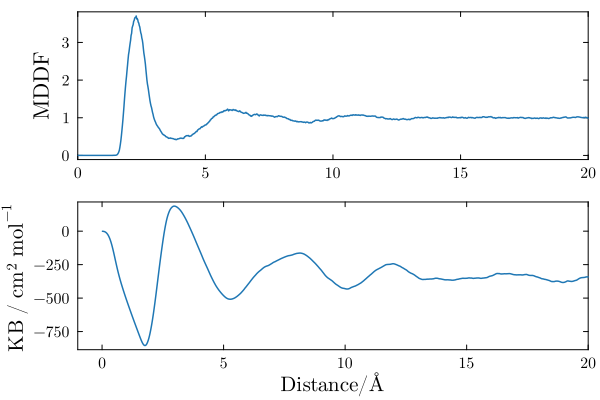
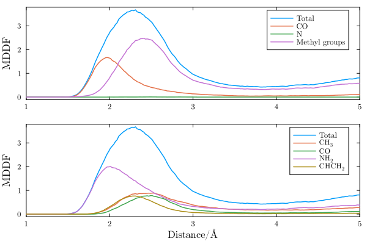

# Polyacrylamide in DMF

In this example we illustrate how the solvation structure of a polymer can be studied with ComplexMixtures.jl. The system is a 5-mer segment of polyacrylamide (PAE - capped with methyl groups), solvated with dimethylformamide (DMF). The system is interesting because of the different functional groups and polarities involved in the interactions of DMF with PAE. A snapshot of the system is shown below.

```@raw html
<center>

</center>
```

The structures of DMF and of the polyacrylamide segment are:

```@raw html
<center>
<table><tr>
<td></td>
<td></td>
</tr>
<tr>
<td align=center>DMF</td>
<td align=center>Polyacrylamide</td>
</tr>
</table>
</center>
```

### Index

- [Data, packages, and execution](@ref data-example2)
- [MDDF and KB integrals](@ref mddf-example2)
- [Group contributions](@ref groups-example2)
- [2D density map](@ref 2Dmap-example2)
- [3D density map](@ref 3Dmap-example2)

## [Data, packages, and execution](@id data-example2)

The files required to run this example are available at [[this link]](https://zenodo.org/records/17202344/files/example2.zip?download=1), and are: 

- `equilibrated.pdb`: The PDB file of the complete system.
- `traj_Polyacry.dcd`: Trajectory file. This is a 275Mb file, necessary for running from scratch the calculations.

To run the scripts, we suggest the following procedure:

1. Create a directory, for example `example2`.
2. Unzip and copy the required data files above to this directory.
3. Launch `julia` in that directory: activate the directory environment, and install the required packages. This launching Julia and executing:
   ```julia
   import Pkg 
   Pkg.activate(".")
   Pkg.add(["ComplexMixtures", "PDBTools", "Plots", "LaTeXStrings", "EasyFit"])
   exit()
   ```
4. Copy the code of each script in to a file, and execute with:
   ```julia
   julia -t auto script.jl
   ```
   Alternatively (and perhaps preferably), copy line by line the content of the script into
   the Julia REPL, to follow each step of the calculation.

## [MDDF and KB integrals](@id mddf-example2)

Here we compute the minimum-distance distribution function, the Kirkwood-Buff integral, and the atomic contributions of the solvent to the density.
This example illustrates the regular usage of `ComplexMixtures`, to compute the minimum distance distribution function, KB-integrals and group contributions. 

```@raw html
<details><summary><font color="darkgreen">Complete example code: click here!</font></summary>
```
```@eval
using Markdown
code = Markdown.parse("""
\`\`\`julia
$(read("./assets/scripts/example2/script1.jl", String))
\`\`\`
""")
```
```@raw html
</details><br>
```

#### Output 

The distribution of DMF molecules around polyacrylamide is shown below. There is a peak at ~2.5Angs, indicating favorable non-specific interactions between the solvent molecules and the polymer. The peak is followed by a dip and diffuse peaks at higher distances. Thus, the DMF molecules are structured around the polymer, but essentially only in the first solvation shell.  



The KB integral in a bicomponent mixture converges to the (negative of the) apparent molar volume of the solute. It is negative, indicating that the accumulation of DMF in the first solvation shell of the polymer is not enough to compensate the excluded volume of the solute. 

## [Group contributions](@id groups-example2)

The MDDF can be decomposed into the contributions of the DMF chemical groups, and on the polyacrylamide chemical groups. In the first panel below we show the contributions of the DMF chemical groups to the distribution function.

```@raw html
<details><summary><font color="darkgreen">Complete example code: click here!</font></summary>
```
```@eval
using Markdown
code = Markdown.parse("""
\`\`\`julia
$(read("./assets/scripts/example2/script2.jl", String))
\`\`\`
""")
```
```@raw html
</details><br>
```

#### Output 

The decomposition reveals that specific interactions peaking at distances slightly smaller than 2$\AA$ exist between the polymer and the carbonyl group of DMF. Thus, there hydrogen bonds between the polymer and this group, which dominate the interactions between the solute and the solvent at short distances. The non-specific interactions peak at 2.5Angs and are composed of contributions of all DMF chemical groups, but particularly of the methyl groups.



The decomposition of the same MDDF in the contributions of the chemical groups of the polymer is clearly associated to the DMF contributions. The specific, hydrogen-bonding, interactions, are associated to the polymer amine groups. The amine groups also contribute to the non-specific interactions at greater distances, but these are a sum of the contributions of all polymer groups, polar or aliphatic.

## [2D density map](@id 2Dmap-example2)

We can decompose the MDDF into the contributions of each portion of the polymer chain. The map below displays the contributions of each chemical group of the polymer, now split into the mers of the polymer, to the MDDF.

```@raw html
<details><summary><font color="darkgreen">Complete example code: click here!</font></summary>
```
```@eval
using Markdown
code = Markdown.parse("""
\`\`\`julia
$(read("./assets/scripts/example2/script3.jl", String))
\`\`\`
""")
```
```@raw html
</details><br>
```

#### Output 

The terminal methyl groups interact strongly with DMF, and strong local density augmentations are visible in particular on the amine groups. These occur at less than 2.0Angs and are characteristic of hydrogen-bond interactions. Interestingly, the DMF molecules are excluded from the aliphatic and carbonyl groups of the polymer, relative to the other groups.

Finally, it is noticeable that the central mer is more weakly solvated by DMF than the mers approaching the extremes of the polymer chain. This is likely a result of the partial folding of the polymer, that protects the central mers from the solvent in a fraction of the polymer configurations.

```@raw html
<center>

</center>
```

## [3D density map](@id 3Dmap-example2)

The contributions of the polymer atoms to the MDDF can also be projected into the space around the polymer,
with the [`grid3D`](@ref grid3D) function, and visualized with the `visualize` function of 
[PDBTools](https://m3g.github.io/PDBTools.jl/stable/visualization/) (version 3.41.0 or greater). 

```@raw html
<details><summary><font color="darkgreen">Complete example code: click here!</font></summary>
```
```@eval
using Markdown
code = Markdown.parse("""
\`\`\`julia
$(read("./assets/scripts/example2/script4.jl", String))
\`\`\`
""")
```
```@raw html
</details><br>
```

#### Output 

The script saves the views as the `grid_hbonds.html` and `grid_second_peak.html` files, which can be opened in any 
web browser. The views are shown below (rotate, zoom, and hover over the points to identify the polymer atoms closest to each point).

!!! note
    The polymer is flexible, and the grid is built around a single conformation of the polymer (the one of 
    the `equilibrated.pdb` file). Thus, the views show the contributions of each polymer atom to the MDDF, 
    averaged over the trajectory, projected into the space around this reference conformation.

The first view displays the regions associated with the hydrogen-bonding peak of the MDDF (distances 
smaller than 2.0Å), with at least 10% of the maximum contribution. The polymer is shown in balls and sticks,
and the grid points as dots, colored from white to red according to their contribution to the MDDF: 

```@raw html
<center>
<iframe src="../assets/scripts/example2/grid_hbonds.html" style="width: 100%; height: 450px; border: none;"></iframe>
</center>
```

These regions surround the hydrogen atoms of the amine groups of the polymer, consistently with the 
hydrogen bonds of these groups with the carbonyl oxygen of DMF. 

The second view displays the regions associated with distances between 2.0 and 3.5Å, with at least
50% of the maximum contribution:

```@raw html
<center>
<iframe src="../assets/scripts/example2/grid_second_peak.html" style="width: 100%; height: 450px; border: none;"></iframe>
</center>
```

At these distances, the contributions of the amine groups are still important, but the terminal methyl groups 
of the polymer (and, to a smaller extent, the carbonyl groups) also contribute, consistently with the 2D map above. 

### References

Molecules built with JSME: B. Bienfait and P. Ertl, JSME: a free molecule editor in JavaScript, Journal of Cheminformatics 5:24 (2013)
[http://biomodel.uah.es/en/DIY/JSME/draw.en.htm](http://biomodel.uah.es/en/DIY/JSME/draw.en.htm)

The system was built with [Packmol](http://m3g.iqm.unicamp.br/packmol).

The simulations were performed with [NAMD](https://www.ks.uiuc.edu/Research/namd/), with [CHARMM36](https://www.charmm.org) parameters.

The interactive 3D views were rendered with [3Dmol.js](https://3dmol.csb.pitt.edu), through the `visualize` function of [PDBTools](https://m3g.github.io/PDBTools.jl/stable/visualization/): N. Rego and D. Koes, 3Dmol.js: molecular visualization with WebGL, Bioinformatics 31, 1322-1324 (2015). [https://doi.org/10.1093/bioinformatics/btu829](https://doi.org/10.1093/bioinformatics/btu829)
