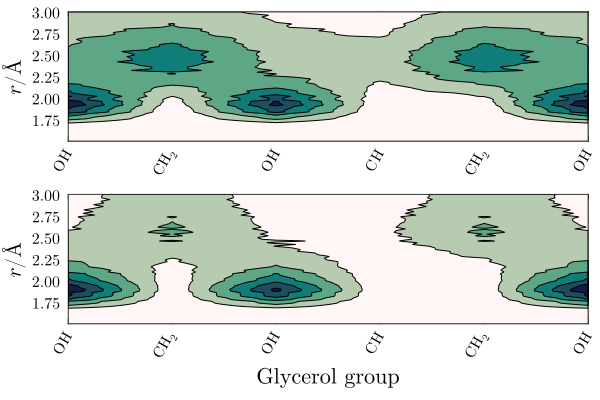

# Glycerol/water mixture

This example illustrates the use of ComplexMixtures.jl to study the solution structure of a crowded (1:1 molar fraction) solution of glycerol in water. Here, we compute the distribution function and atomic contributions associated to the inter-species interactions (water-glycerol) and the glycerol-glycerol auto-correlation function. This example aims to illustrate how to obtain a detailed molecular picture of the solvation structures in an homogeneous mixture.

The system simulated consists of 1000 water molecules (red) and 1000 glycerol molecules (purple).
```@raw html
<center>

</center>
```

### Index

- [Data, packages, and execution](@ref data-example4)
- [Glycerol-Glycerol and Water-Glycerol distribution functions](@ref glyc_mddf-example4)
- [Glycerol group contributions to MDDFs](@ref glyc-groups-example4)
- [2D map of group contributions](@ref map-example4)

## [Data, packages, and execution](@id data-example4)

The files required to run this example are available at [[this link]](https://zenodo.org/records/17202344/files/example4.zip?download=1), and are: 

- `equilibrated.pdb`: The PDB file of the complete system.
- `traj_Glyc.dcd`: Trajectory file. This is a 200Mb file, necessary for running from scratch the calculations.

To run the scripts, we suggest the following procedure:

1. Create a directory, for example `example4`.
2. Unzip and copy the required data files above to this directory.
3. Launch `julia` in that directory: activate the directory environment, and install the required packages. This launching Julia and executing:
   ```julia
   import Pkg 
   Pkg.activate(".")
   Pkg.add(["ComplexMixtures", "PDBTools", "Plots", "LaTeXStrings", "EasyFit"])
   exit()
   ```
4. Copy the code of each script in to a file, and execute with:
   ```julia
   julia -t auto script.jl
   ```
   Alternativelly (and perhaps preferrably), copy line by line the content of the script into
   the Julia REPL, to follow each step of the calculation.

## [Glycerol-Glycerol and Water-Glycerol distribution functions](@id glyc_mddf-example4)

The first and most simple analysis is the computation of the minimum-distance distribution functions between the components of the solution. In this example we focus on the distributions of the two components relative to the glycerol molecules. Thus, we display the glycerol auto-correlation function, and the water-glycerol correlation function in the first panel of the figure below. The second panel displays the KB integrals of the two components computed from each of these distributions.

```@raw html
<details><summary><font color="darkgreen">Complete example code: click here!</font></summary>
```
```@eval
using Markdown
code = Markdown.parse("""
\`\`\`julia
$(read("./assets/scripts/example4/script1.jl", String))
\`\`\`
""")
```
```@raw html
</details><br>
```


Both water and glycerol form hydrogen bonds with (other) glycerol molecules, as indicated by the peaks at ~1.8$$\mathrm{\AA}$$. The auto-correlation function of glycerol shows a more marked second peak corresponding to non-specific interactions, which (as we will show) are likely associated to interactions of its aliphatic groups.

The KB integrals in the second panel show similar values water and glycerol, with the KB integral for water being slightly greater. This means that glycerol molecules are (sightly, if the result is considered reliable) preferentially hydrated from a macroscopic standpoint.

## [Glycerol group contributions to MDDFs](@id glyc-groups-example4)

```@raw html
<details><summary><font color="darkgreen">Complete example code: click here!</font></summary>
```
```@eval
using Markdown
code = Markdown.parse("""
\`\`\`julia
$(read("./assets/scripts/example4/script2.jl", String))
\`\`\`
""")
```
```@raw html
</details><br>
```


## [2D map of group contributions](@id map-example4)

The above distributions can be split into the contributions of each glycerol chemical group. The 2D maps below display this decomposition.

```@raw html
<details><summary><font color="darkgreen">Complete example code: click here!</font></summary>
```
```@eval
using Markdown
code = Markdown.parse("""
\`\`\`julia
$(read("./assets/scripts/example4/script3.jl", String))
\`\`\`
""")
```
```@raw html
</details><br>
```



The interesting result here is that the $$\mathrm{CH}$$ group of glycerol is protected from both solvents. There is a strong density augmentation at the vicinity of hydroxyl groups, and the second peak of the MDDFs is clearly associated to interactions with the $$\mathrm{CH_2}$$ groups.