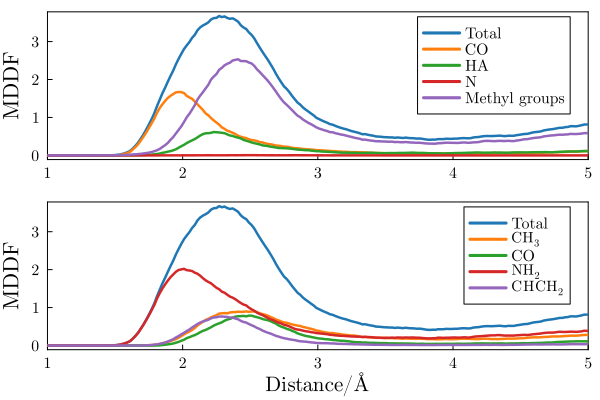
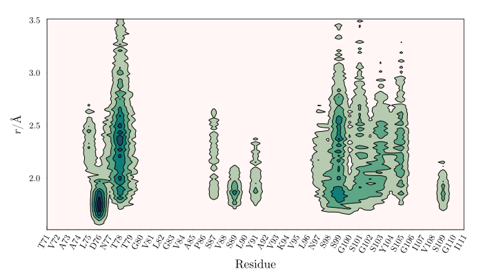
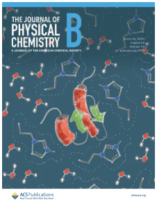

# Introduction

[ComplexMixtures.jl](https://github.com/m3g/ComplexMixtures.jl) is a package to study the solute and solvent interactions of
mixtures of molecules of complex shape. Conventional radial distribution
functions are not appropriate to represent the structure of a solvent
around a solute with many atoms, and a variable, non-spherical shape.     

Typical solutes of complex shape are proteins, nucleic acids, and
polymers in general. Smaller molecules like lipids, carbohydrates, etc,
are also complex enough such that representing the structure of the
solution of those molecules with distribution functions is not trivial.

Minimum-Distance Distribution Functions (MDDFs) are a very general and
practical way to represent solute-solvent interactions for molecules
with arbitrarily complex sizes and geometries. Briefly, instead of
computing the density distribution function of a particular atom or the
center-of-mass of the molecules, one computes the distribution function
of the minimum-distance between any solute and solvent atoms. This
provides a size and shape-independent distribution which is very natural
to interpret in terms of molecular interactions.   

Additionally, the MDDFs can be decomposed into contributions of each
type of atom (or groups of atoms) of the solute and solvent molecules,
such that the profiles of the distributions can be interpreted in terms
of the chemical nature of the species involved in the interactions at
each distance.   

Finally, as with radial distribution functions, MDDFs can be used to
compute Kirkwood-Buff integrals to connect the accumulation or depletion
of the solvents components to thermodynamic properties, like protein
structural stability, solubility, and others.

!!! compat
    Important: This manual refers to version 2 of ComplexMixtures.jl. There
    are syntax changes relative to the 1.X series, and analysis scripts 
    written for the previous versions won't work. The list of changes
    necessary to updated the scripts is described [here](@ref updating-scripts).

## Help!

Please ask for help if having any difficulty using the package. Reach us by:

- Asking a question on the [Julia Discourse forum](https://discourse.julialang.org/). Please
  mark `@lmiq` on your post, otherwise we may miss it! This may be very effective to get help from 
  many Julia users on questions not directly related to physical-chemistry.
- [Opening an issue](https://github.com/m3g/ComplexMixtures.jl/issues/new/choose) if you think you found a problem in the package.
  Even documentation problems can be reported.
- Joining us at Zulip-chat in the [m3g stream](https://julialang.zulipchat.com/#narrow/stream/435348-m3g) of the Julia Zulip forum.
- Sending an e-mail to: [lmartine@unicamp.br](mailto:lmartine@unicamp.br?subject="ComplexMixtures.jl help").

## Features

Check out our [examples](@ref examples), featuring the analysis of solvation structures for proteins, polymers, membrane, and complex solutions! The examples are also described in our [featured article](https://doi.org/10.1016/j.molliq.2021.117945).

### 1. Minimum-distance distribution functions: understanding solvation at a molecular level

This figure illustrates one of the main features of minimum-distance distribution functions, by showing the distribution of DMF molecules at the surface of an polyacrylamide molecule. The direct interactions are evident by the peak at hydrogen-bonding distances and, additionally, the contribution of each group of atoms of the DMF can be clearly distinguished by decomposing the total MDDF into atomic or chemical group contributions. 

```@raw html
<center>

<br>
<b>Minimum distance distribution function and its decomposition into the chemical
groups of the solvent (top) and solute (bottom) molecules.<br><br></b> 
</center>
```

Decomposition of the total MDDF into the contributions of the solute atoms (in this case, a protein) is also possible. Any chemical group decomposition is possible. Here, we decompose the MDDF into the contribution of each protein residue. 

```@raw html
<center>

<br>
<b>Density map of a solvent in the vicinity of each protein residue.</b> 
</center>
```

### 2. Thermodynamic interpretation through Kirkwood-Buff theory

Minimum-distance distribution functions can be used to compute Kirkwood-Buff integrals, and thus, thermodynamic parameters associated to solvation. 

Kirkwood-Buff integrals carry the information of the total accumulation or depletion of each solvent around a solute. For example, the figure below displays the KB integrals of an ionic liquid solvating different conformational states of a protein [[link]](https://www.sciencedirect.com/science/article/pii/S016773222201491X?via%3Dihub). The figure illustrates that the solvation structures are dependent on the protein folding state. 

```@raw html
<center>

<br>
<b>Kirkwood-Buff integrals of an ionic liquid solvating a protein in different conformational states.</b><br><br> 
</center>
```

From differences in KB integrals among cosolvents, the Preferential Solvation parameter can be computed. This is an important parameter because it can be measured experimentally and is ultimately associated with the equilibrium thermodynamics of the solvation. In the following figure, we show that, for example, the preferential solvation of a protein in different folding states is dependent in a non-trivial way on the concentration of an ionic liquid in aqueous solutions. 

```@raw html
<center>

<br>
<b>Preferential interaction parameters obtained for the solvation of a protein by ionic liquids.</b><br><br>
</center>
```

In particular, the plot shows that besides being preferentially excluded from the protein surface at high concentrations in the native state, suggesting protein folding stabilization, the interactions with the protein in the denatured states are stronger, leading to denaturation at all concentrations. 

## References

Please cite the following articles if the package was useful to you:

* L. Martínez, **ComplexMixtures.jl: Investigating the structure of solutions of complex-shaped molecules from a solvent-shell perspective.** *J. Mol. Liq.* 347, 117945, 2022. [[Full Text]](https://doi.org/10.1016/j.molliq.2021.117945)

* L. Martínez, S. Shimizu, **Molecular interpretation of preferential interactions in protein solvation: a solvent-shell perspective by means of minimum-distance distribution functions.** *J. Chem. Theor.  Comp.* 13, 6358–6372, 2017. [[Full Text]](http://pubs.acs.org/doi/abs/10.1021/acs.jctc.7b00599)

## See also

### Seminar

* Presentation about ComplexMixtures.jl and protein-solvent interactions: [https://youtu.be/umSRjsITzyA](https://youtu.be/umSRjsITzyA)

### Applications

* A. F. Pereira, L. Martínez, **Osmolyte Structural and Thermodynamic Effects Across the Protein Folding Landscape**, *JACS Au*, 2025. [[Full Text]](https://doi.org/10.1021/jacsau.5c00813). 

```@raw html
<a href="https://pubs.acs.org/toc/jpcbfk/129/27"></a>
```

* V. Piccoli, L. Martínez, **Cation Hydrophobicity Effects on Protein Solvation in Aqueous Ionic Liquids**, *J. Phys. Chem. B*, 129 (27) 6765-6776, 2025. [[Full Text]](https://pubs.acs.org/doi/10.1021/acs.jpcb.5c00779). 

* F. C. Ramos, L. Martínez, **Molecular dynamics and solvation structures of the β-glucosidase from Humicola insolens (BGHI) in aqueous solutions containing glucose**
  *Int. J. Biol. Macromol.* 286 (138210) 2025. [[Full Text]](https://doi.org/10.1016/j.ijbiomac.2024.138210)

* V. Piccoli, L. Martínez, **Competitive Effects of Anions on Protein Solvation by Aqueous Ionic Liquids.** 
  *J. Phys. Chem. B* 128, 7792-7802, 2024. [[Full Text]](https://pubs.acs.org/doi/10.1021/acs.jpcb.4c03735)

* A. F. Pereira, L. Martínez, **Helical Content Correlations and Hydration Structures of the Folding Ensemble of the B Domain of Protein A.**
  *J. Chem. Inf. Model.* 64, 3350-3359, 2024. [[Full Text]](https://doi.org/10.1021/acs.jcim.3c01822)

* A. F. Pereira, V. Piccoli, L. Martínez, **Trifluoroethanol direct interactions with protein backbones destabilize alpha-helices.** 
  *J. Mol. Liq.* 365, 120209, 2022. [[Full Text]](https://doi.org/10.1016/j.molliq.2022.120209)

* V. Piccoli, L. Martínez, **Ionic liquid solvation of proteins in native and denatured states.** 
  *J. Mol. Liq.* 363, 119953, 2022. [[Full Text]](http://dx.doi.org/10.1016/j.molliq.2022.119953)

* V. Piccoli, L. Martínez, **Correlated counterion effects in the solvation of proteins by ionic-liquids.** *J. Mol. Liq.* 320, 114347, 2020.
  [[Full Text]](https://doi.org/10.1016/j.molliq.2020.114347)

* I. P. de Oliveira, L. Martínez, **The shift in urea orientation at protein surfaces at low pH is compatible with a direct mechanism of protein denaturation.** *Phys. Chem. Chem. Phys.* 22, 354-367, 2020.
  [[Full Text]](https://pubs.rsc.org/en/content/articlelanding/2019/CP/C9CP05196A#!divAbstract)

* I. P. de Oliveira, L. Martínez, **Molecular basis for competitive solvation of the Burkholderia cepacia lipase by sorbitol and urea.**
  *Phys. Chem. Chem. Phys.* 18, 21797-21808, 2016.
  [[Full Text]](https://pubs.rsc.org/en/content/articlelanding/2016/cp/c6cp01789d#!divAbstract)

