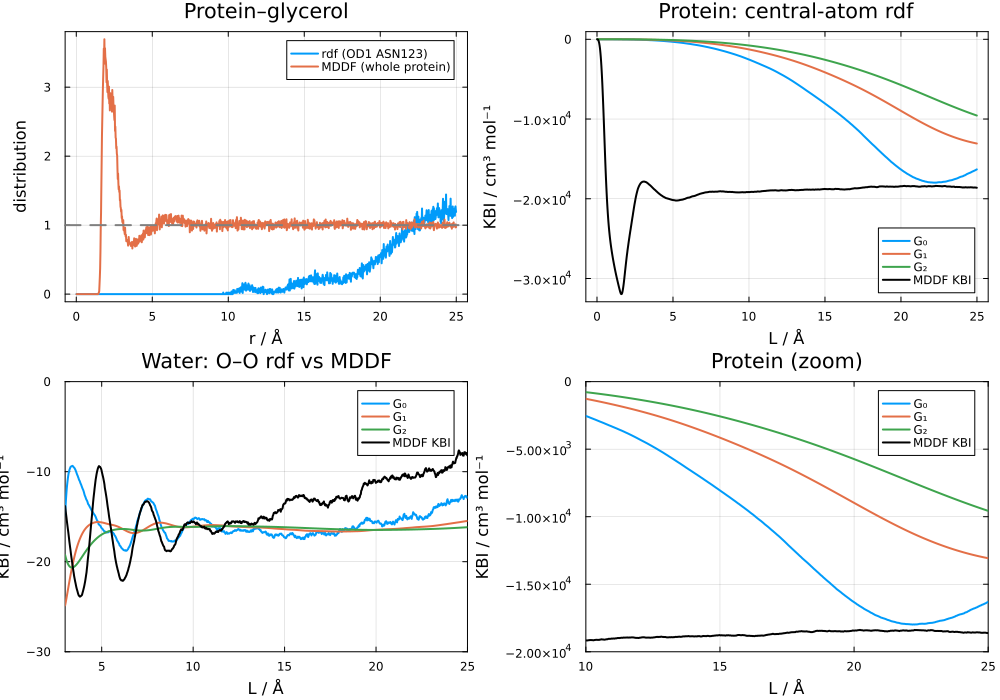
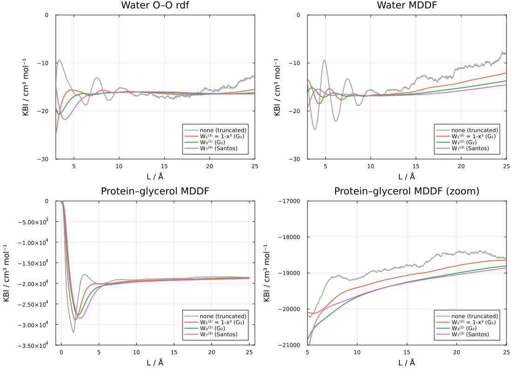
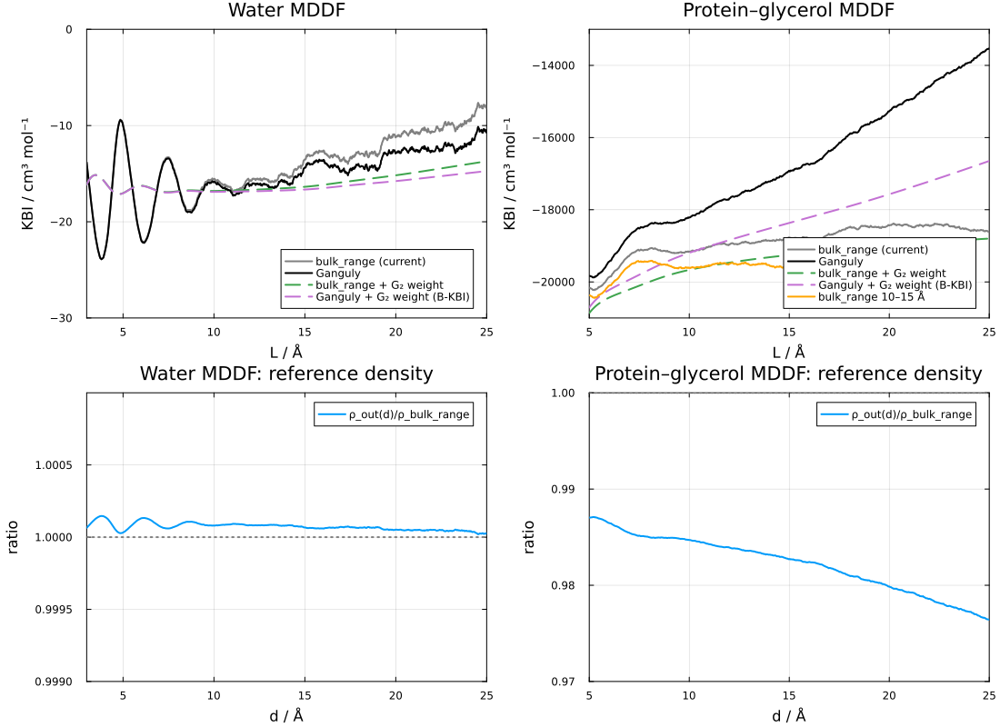
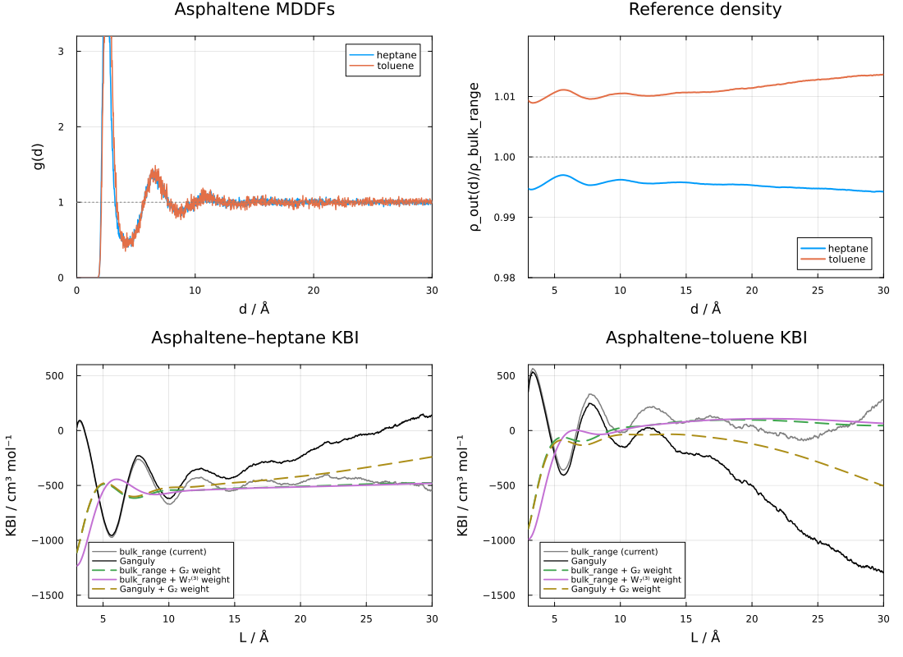
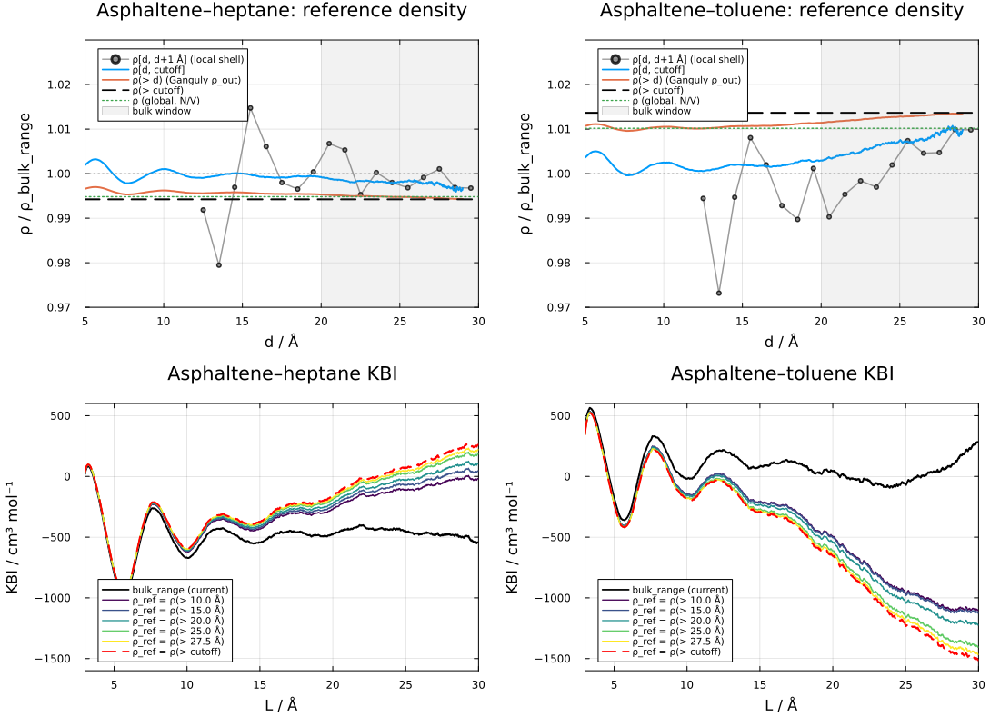
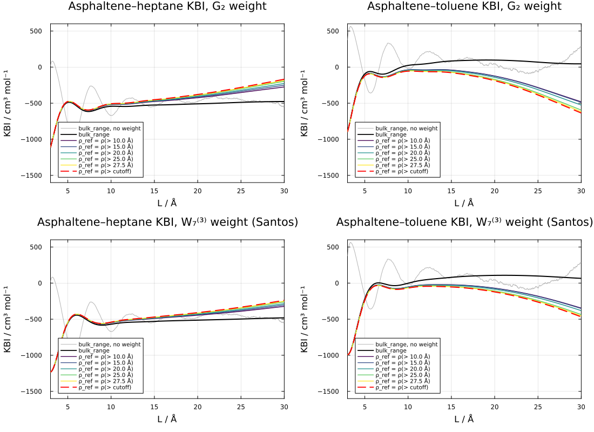

# Notes on KBI convergence

!!! note
    This page records an analysis of the convergence of Kirkwood-Buff integrals (KBIs) computed
    from radial (RDF) and minimum-distance (MDDF) distribution functions, and of the normalization 
    of these distributions in closed (finite) simulation boxes. It is a working document: none of 
    the procedures discussed here, except those described in [Kirkwood-Buff integrals](@ref kbi), are 
    currently implemented in the package. The code blocks are not executed when the documentation 
    is built, and the protein data is not distributed with the package.

## Systems analyzed

- **Pure water** (6845 molecules, cubic box of ~58.7 Å). Two results files from the same trajectory,
  available in the test data:
  - `rwO_20_25.json`: water oxygen as solute and solvent, a radial distribution function.
  - `rw_20_25.json`: complete water molecules as solute and solvent, a minimum-distance distribution.
- **Protein in water/glycerol** (the system of the [Protein in water/glycerol](@ref example1) example, 
  4302 glycerol molecules, box volume ~1.26×10⁶ ų, side ~108 Å). The protein–glycerol MDDF was computed with 
  `bulk_range=(20.0, 25.0)` and `bulk_range=(10.0, 15.0)`. An RDF was also computed using as the
  solute a single atom of the protein, the atom closest to its center of mass (OD1 of ASN 123,
  1.6 Å from the center of mass; the protein extends up to ~28 Å from its center).

- **Asphaltene in heptane/toluene** (one asphaltene model molecule of 54 atoms, 2080 heptane and 1230 toluene
  molecules, cubic box of ~90 Å, 1000 frames). The MDDFs of the asphaltene relative to each solvent component
  were computed with `dbulk=20.0` and `cutoff=30.0`. This is discussed in a [separate section](@ref kbi_notes_asphaltene).

Throughout, ``L`` is the upper limit of integration, and the estimators ``G_0``, ``G_1`` and ``G_2`` are
those of [`kbi`](@ref).

## RDF versus MDDF KBIs



**Water (bottom left).** The ``G_2`` estimator of the O–O RDF is stable at about -16 cm³ mol⁻¹. The 
KBI of the MDDF reaches similar values at 8–12 Å (about -15.7 cm³ mol⁻¹), and drifts upward at
larger distances (to about -8 cm³ mol⁻¹ at 25 Å). The drift of the truncated RDF KBI (``G_0``) and that of 
the MDDF KBI are of the same magnitude for ``L > 16`` Å. The additional drift of the MDDF KBI originates mostly
in the 12–16 Å range, where the MDDF deviates from one by ~4×10⁻⁴, an amount comparable to the 
uncertainty in the bulk density (the bulk densities of the two runs differ by 2×10⁻⁴ in relative 
terms). The shell volumes of the MDDF are only 4–9% larger than those of the RDF in this range, thus the
difference is not geometric. We found no evidence that the additional drift is intrinsic to the MDDF.

**Protein (top and bottom right).** The RDF computed from the central atom is zero up to ~10 Å, and 
reaches one only at ~22 Å. The KBI is dominated by the excluded volume of the protein, and none of
the estimators (``G_0``, ``G_1``, ``G_2``) converges up to 25 Å. The MDDF, on the other side, 
has its first peak at ~2 Å and is close to one beyond ~5 Å, and its KBI appears to converge at 
~-18500 to -19000 cm³ mol⁻¹. (This apparent convergence is questioned in the sections below.)

The reason for the different behavior is that the RDF measures distances from an atom, such that
the excluded volume of a large solute extends to distances of the order of its radius, while the MDDF 
measures distances from the surface of the solute, such that the excluded volume is always at 
``d \lesssim 2-3`` Å. The size of the solute is transferred to the volume element of the MDDF.

## Weight functions applied to the MDDF

### The argument of Santos

Santos [3] showed that the derivation of the weight functions of Krüger and Vlugt [1, 2] is purely 
mathematical. Any one-dimensional integral can be written as a volume integral in ``d`` dimensions:

```math
I[F] = \int_0^\infty F(r)\,dr = \int d^d\mathbf r\,\frac{F(r)}{\Omega_d\, r^{d-1}}
```

and the finite-sphere identity

```math
\int_0^L F(r)\, y_d(r/L)\, dr = I[F] - \frac{a_d}{L}\, I[F r] + O(L^{-3})
```

where ``\Omega_d y_d(x)`` is the intersection volume of two ``d``-dimensional spheres of unit diameter
separated by ``x``, holds for any ``F`` with finite moments. The error is ``O(L^{-3})`` because ``y_d(x) - 1`` 
has no ``x^2`` term (for odd ``d`` it is an odd polynomial). Applying the identity recursively to 
``F r^n`` eliminates the unknown moments, giving 

```math
I[F] = \int_0^L F(r)\, W_d^{(k)}(r/L)\, dr + O(L^{-3}), \qquad W_d^{(k)}(x) = y_d(x)\sum_{n=0}^{k} (a_d x)^n.
```

``G_2`` corresponds to ``(d, k) = (3, 2)`` and ``G_1`` to ``(d, k) = (1, 2)``. Larger ``d`` produces weights that 
vanish more smoothly at ``x = 1``, which is beneficial for long correlation lengths. Santos recommends 
``W_7^{(3)}(x) = (1-x)^4 (1 + 35x/16)(1 + 1225x^2/256)(1 + 29x/16 + 5x^2/4 + 5x^3/16)``.

Since the integral is "blind" to the origin of ``F``, the weights can be applied to the integrand of the
MDDF KBI, ``F(d) = [g_{md}(d) - 1]\, dV/dd``, although the interpretation of ``G(L)`` as the KBI of a 
finite sphere is lost.

### The caveat: monotonic integrands

The residual error is controlled by the moments ``I[F r^n]``, ``n \geq 3``. If ``F`` oscillates, these moments
are small (positive and negative lobes cancel), and the weights reduce the error associated with the
oscillations at ``r = L``. If ``F`` decays monotonically, the moments are not small, and the weighted 
integral has an algebraic error of order ``(\xi/L)^3``, where ``\xi`` is the correlation length, while the 
truncated integral has an error that decays as the tail ``\int_L^\infty F``. In this case truncation is the 
better estimate. In the extreme case of ``F`` vanishing beyond some ``r_0 < L``, truncation is exact, and the
weighted integral is not.

### The excluded volume

A contribution ``A`` to the KBI localized at a distance ``r_0`` is integrated as 
``A\,W(r_0/L) \approx A[1 - c_3 (r_0/L)^3]``, with ``c_3 = 23/8`` for ``G_2``. Thus, the excluded volume
of the solute affects the weighted estimators in proportion to ``(r_0/L)^3``. Fraction of the excluded-volume
contribution lost by the ``G_2`` weight:

| Case | L = 10 Å | L = 20 Å | L = 25 Å |
|:-----|:--------:|:--------:|:--------:|
| Protein MDDF (``d < 2.5`` Å) | 1.1% | 0.15% | 0.08% |
| Protein central-atom RDF (``r < 20`` Å) | 69% | 65% | 43% |
| Water O–O RDF (``r < 2.5`` Å) | 2.1% | 0.27% | 0.14% |

The weights are, therefore, harmless for the MDDF of a large solute, while they fail completely
for the RDF of a buried atom.

### Results



KBIs (cm³ mol⁻¹) computed with the weights applied to the RDF and MDDF integrands:

| | L (Å) | truncated | ``W_1^{(2)}`` (``G_1``) | ``W_3^{(2)}`` (``G_2``) | ``W_7^{(3)}`` |
|:--|:--:|:--:|:--:|:--:|:--:|
| Water O–O RDF | 10 / 15 / 20 / 25 | -15.2 / -17.3 / -15.6 / -12.8 | -16.1 / -16.4 / -16.5 / -15.5 | -16.1 / -16.2 / -16.5 / -16.2 | -16.1 / -16.0 / -16.3 / -16.4 |
| Water MDDF | 10 / 15 / 20 / 25 | -15.6 / -13.5 / -11.2 / -8.2 | -16.7 / -15.9 / -14.1 / -12.0 | -16.8 / -16.4 / -15.2 / -13.7 | -16.8 / -16.6 / -15.8 / -14.5 |
| Protein MDDF | 10 / 15 / 20 / 25 | -19159 / -18764 / -18437 / -18618 | -19407 / -19067 / -18800 / -18643 | -19668 / -19255 / -19005 / -18800 | -19641 / -19270 / -19048 / -18857 |

- For water, the weights remove the oscillations of both the RDF and the MDDF KBIs. ``W_7^{(3)}`` is
  the most stable at long distances. The weighted MDDF KBIs reach -16.7 to -16.8 cm³ mol⁻¹ at 8–12 Å,
  close to the -16.1 cm³ mol⁻¹ of the RDF. The long-range drift is damped, but not removed, consistently
  with it not being a truncation effect.
- For the protein, the weights remove the oscillations near contact, but all estimates drift slowly
  (from ~-19650 at 10 Å to ~-18850 cm³ mol⁻¹ at 25 Å). The unweighted KBI also drifts by ~700 cm³ mol⁻¹
  between 10 and 20 Å. The tail of the integrand is monotonic, which is the case where the weights 
  do not help.

The weighted integrals were computed from the per-bin excess counts:

```julia
using ComplexMixtures: units
W3(x) = (1 - x)^2 * (1 + x/2) * (1 + 3x/2 + 9x^2/4)  # G₂
hmd(R) = (R.md_count .- R.md_count_random) ./ R.density.solvent_bulk # ų per bin
function wkbi(h, R, W)
    L = [i * R.files[1].options.binstep for i in eachindex(R.d)]
    return [units.Angs3tocm3permol * sum(h[i] * W(R.d[i] / L[j]) for i in 1:j) for j in eachindex(L)]
end
wkbi(hmd(R), R, W3)
```

## Shape-dependent finite-volume KBIs

Krüger and Vlugt [2] showed that, for a finite subvolume ``V`` of any shape, the two-point integral 

```math
G(V) = \frac{1}{V}\int_V d\mathbf r_1 \int_V d\mathbf r_2\, h(r_{12}) = \int_0^\infty h(r)\,w(r)\,dr,
\quad
w(r) = 4\pi r^2\left(1 - \frac{A}{4V}\,r + O(r^2)\right)
```

such that ``G(V) = G_\infty + F_\infty/L + O(L^{-2})``, with ``L = 6V/A``. The ``O(L^{-3})`` error of ``G_2`` 
requires spherical subvolumes (for a cube, ``w(r)`` already has an ``x^2`` term).

This result does not apply to the MDDF KBI. ``G(V)`` averages over pairs of particles that are both 
inside ``V``, and is associated with the fluctuations of the number of particles in an open subvolume. 
The MDDF KBI is a one-center integral (the solute is fixed, and the solvent is counted in the domain
around it), which is the analogue of the truncated integral ``G_0``. For a one-center integral in an
open system there is no ``1/L`` (or ``A/V``) term: once ``L`` exceeds the correlation length, the 
integral converges as its tail vanishes. A linear dependence of the MDDF KBI on ``A/V`` of the
solute domain is, thus, not a surface term, and should not be extrapolated. It must arise from 
other sources, such as a slow tail of the distribution or the closed-system errors discussed next.

## Bulk density and closed-system corrections

### The Ganguly correction is a bulk-density normalization

The correction of Ganguly and van der Vegt [4], as written by Milzetti et al. [5], is

```math
g^{\rm G}(r) = g(r)\,\frac{N_j f(r)}{N_j f(r) - \Delta N_{ij}(r) - \delta_{ij}},\qquad f(r) = 1 - \frac{V(r)}{V_{\rm tot}}.
```

The numerator is ``\rho\,[V_{\rm tot} - V(r)]``, and the denominator is the number of solvent molecules
outside ``r`` (excluding the reference molecule if it is of the same type). Thus, the correction
renormalizes ``g(r)`` by the density outside ``r``:

```math
\rho_{\rm out}(r) = \frac{N - \delta - N_{\rm in}(r)}{V_{\rm tot} - V(r)}.
```

This is the same expression used by `ComplexMixtures` to compute the bulk density when only
`dbulk` is defined (`usecutoff = false`), evaluated at every ``r`` instead of only at `dbulk`. 
When `bulk_range` is defined, the density is estimated from the solvent molecules in the bulk window.
Beyond the correlation length, ``\rho_{\rm out}(r)`` is constant and equal to the local bulk density 
of the closed system, which is the quantity estimated in the bulk window. Thus, both modes of
`ComplexMixtures` are, to leading order, Ganguly-type normalizations: `bulk_range` estimates the
density from a shell (noisier, but it does not assume the rest of the box to be uniform), and `dbulk`
from all the rest of the box.

The number of molecules outside `dbulk` is perfectly anticorrelated with the number of molecules
inside it, in each frame. This does not invalidate the estimate: the correction uses only average 
numbers of molecules, and the anticorrelation is precisely the closed-system depletion effect that 
the correction accounts for.

### Comparison of corrections in the literature

Milzetti et al. [5] compared these corrections for urea–water mixtures. Relevant findings:

- The best estimator (B-KBI) is the Ganguly-corrected RDF integrated with the Krüger weight
  ``4\pi r^2 (1 - x^3)`` (i.e., ``G_1``). The RDF must be corrected before weighting. Normalizing the 
  distribution by the bulk density and then applying `kbi(R; correction=:G2)` is equivalent, with a better weight.
- Besides suppressing oscillations, the weight reduces the influence of the noisy tail of the RDF.
- The box behaves as a particle bath when the probed volume is a small fraction of the total volume
  (2.6% in their example). In the systems analyzed here:

  | System | ``V(\text{dbulk})/V_{\rm tot}`` | ``V(\text{cutoff})/V_{\rm tot}`` |
  |:-------|:--:|:--:|
  | Water, bulk range 20–25 Å | 0.18 | 0.34 |
  | Protein, bulk range 20–25 Å | 0.25 | 0.36 |
  | Protein, bulk range 10–15 Å | 0.11 | 0.17 |

- Two ways of reading the KBI are compared: the average of the uncorrected KBI over one oscillation
  in the correlated region (CR), and the plateau of the B-KBI at long distances (LR). For large boxes,
  CR was more robust; LR failed for poorly sampled or nonideal systems, which they diagnose by a slope 
  larger than 10 cm³ mol⁻¹ nm⁻¹ of the B-KBI tail.
- The two-system-size correction of Krüger et al. was the noisiest of the methods.

### The Ganguly normalization applied to the MDDF

With the quantities stored in a `Result`, the reference density outside ``d`` and the corresponding 
KBI integrand are:

```julia
function ganguly(R; self=false)
    ρb = R.density.solvent_bulk
    Vd = cumsum(R.md_count_random) ./ ρb   # volume of the domain within d (ų)
    Nin = cumsum(R.md_count)                # solvent molecules within d
    N = R.solvent.nmols - (self ? 1 : 0)
    ρout = @. (N - Nin) / (R.volume.total - Vd)
    h = @. R.md_count / ρout - R.md_count_random / ρb  # ų per bin
    return h, ρout
end
```



KBIs in cm³ mol⁻¹:

| | L (Å) | `bulk_range` | Ganguly | Ganguly + ``G_2`` weight | ``\rho_{\rm out}/\rho_{\rm bulk}`` |
|:--|:--:|:--:|:--:|:--:|:--:|
| Water MDDF | 10 | -15.6 | -15.9 | -16.9 | 1.00008 |
| | 20 | -11.2 | -12.9 | -15.8 | 1.00005 |
| | 25 | -8.2 | -10.7 | -14.7 | 1.00003 |
| Protein MDDF | 10 | -19159 | -18213 | -19196 | 0.98471 |
| | 20 | -18437 | -15276 | -17573 | 0.97987 |
| | 25 | -18618 | -13537 | -16650 | 0.97644 |

- **Water.** The two normalizations agree to 10⁻⁴, and the Ganguly normalization slightly reduces 
  the long-range drift. The combination with the ``G_2`` weight is the most stable estimate.
- **Protein.** The density of glycerol in the rest of the box is 1.5–2.5% lower than in the 
  20–25 Å bulk window, and ``\rho_{\rm out}(d)`` decreases steadily with ``d``. The bulk densities obtained
  with the two bulk windows also differ: ``\rho_{\rm bulk}/\rho`` is 1.0464 for 10–15 Å and 1.0402 for
  20–25 Å, which explains the ~4% difference (~800 cm³ mol⁻¹) between the KBIs obtained with the two 
  windows. The glycerol density keeps varying with the distance to the protein up to, and beyond, 
  the cutoff: there is no region of uniform bulk density in this box. This may be associated 
  with a long-range composition gradient, with insufficient sampling of the glycerol/water 
  composition fluctuations, or both.

Consequently, the apparent convergence of the MDDF KBI of the protein, obtained with `bulk_range`, 
hides a systematic uncertainty. The KBI depends on whether the reference density is that of a 
shell or that of the rest of the box, and varies from ~-13500 to ~-19500 cm³ mol⁻¹, a spread of 
25–30%. A flat running KBI does not, by itself, demonstrate convergence when the bulk density is 
estimated from a window within the integration range, because the normalization forces the average
of ``g - 1`` to vanish in that window.

## [A small solute in a mixed solvent: asphaltene in heptane/toluene](@id kbi_notes_asphaltene)

The asphaltene model is a small solute (54 atoms, with a largest interatomic distance of ~18 Å), solvated by a
heptane/toluene mixture (molar fraction of toluene 0.37). The MDDFs of the asphaltene relative to
heptane and to toluene were computed from the same trajectory, with `dbulk=20.0` and `cutoff=30.0`
(the bulk density is estimated in the 20–30 Å shell). There is a single solute molecule, and 1000 frames.
Only the MDDFs are available for this system: the RDFs, which require the trajectory, were not computed.



**Correlation length.** Both MDDFs have a first peak at ~2.4 Å (heptane) and ~2.7 Å (toluene), a second solvation shell at 6–7 Å,
and are indistinguishable from one beyond ~12 Å. Averaged over 0.5 Å bins, ``g(d)`` fluctuates around
one by 0.3–0.6% in the 20–30 Å range, which is of the order of the statistical noise of the counts.
The correlations are, thus, short-ranged compared to the size of the domain.

**Weights.** The truncated KBIs (`R.kb`, gray) oscillate by ±200–300 cm³ mol⁻¹ up to the cutoff. 
These oscillations are mostly noise of the integrand at long distances, amplified by the volume 
of the shells. The ``G_2`` and ``W_7^{(3)}`` weights applied to the MDDF integrand (computed as in the 
previous sections) remove the oscillations, and give stable values from ``L \approx 8`` Å up to 
the cutoff. Here the weights are useful because the integrand beyond the second shell is noise
around zero, and not a monotonic tail.

**Reference density.** The ratio ``\rho_{\rm out}(d)/\rho_{\rm bulk}`` is approximately constant, 
but different from one: ~0.995 for heptane and ~1.010–1.014 for toluene. That is, the 20–30 Å shell
used to estimate the bulk density is enriched in heptane by 0.5% and depleted in toluene by 1% 
relative to the rest of the box. These differences correspond to only two or three molecules in the
shell (which contains, on average, ~400 heptane and ~225 toluene molecules), and are much larger than 
the closed-system depletion caused by the solute (``\rho G/V \approx 0.1\%`` for heptane, and 
negligible for toluene). They are, most likely, 
composition fluctuations of the mixture not averaged out in 1000 frames of a single solute 
molecule. Because the integration volume grows with ``L``, an offset of 1% in the reference density
produces a drift of ~1% of ``V(L)`` in the KBI, which is ~250 cm³ mol⁻¹ at 25 Å, and of the order 
of the KBIs themselves. This is the drift of the Ganguly-normalized KBIs (black).

KBIs in cm³ mol⁻¹:

| | L (Å) | truncated | ``G_2`` weight | ``W_7^{(3)}`` weight | Ganguly | Ganguly + ``G_2`` weight | ``\rho_{\rm out}/\rho_{\rm bulk}`` |
|:--|:--:|:--:|:--:|:--:|:--:|:--:|:--:|
| Heptane | 10 | -669 | -543 | -570 | -617 | -520 | 0.9962 |
| | 15 | -544 | -525 | -530 | -423 | -475 | 0.9958 |
| | 20 | -480 | -509 | -513 | -245 | -417 | 0.9953 |
| | 25 | -450 | -488 | -498 | -34 | -336 | 0.9948 |
| Toluene | 10 | -17 | 23 | -2 | -144 | -38 | 1.0105 |
| | 15 | 80 | 85 | 80 | -205 | -39 | 1.0107 |
| | 20 | 41 | 97 | 107 | -504 | -121 | 1.0114 |
| | 25 | -65 | 69 | 98 | -1023 | -286 | 1.0128 |
| Toluene − heptane | 10 | 652 | 566 | 568 | 473 | 482 | |
| | 15 | 624 | 610 | 610 | 218 | 436 | |
| | 20 | 521 | 606 | 621 | -259 | 296 | |
| | 25 | 385 | 557 | 596 | -989 | 50 | |

- The weighted `bulk_range` estimates are the most stable: ~-500 cm³ mol⁻¹ for heptane and ~50–100 
  cm³ mol⁻¹ for toluene, giving a preferential solvation of the asphaltene by toluene of 
  ``G_{\rm tol} - G_{\rm hep} \approx 550-620`` cm³ mol⁻¹. As discussed for the protein, part of this 
  stability is enforced by the normalization in the bulk window.
- At ``L \approx 10`` Å, where the correlations have decayed but the integration volume is still
  small, all estimates agree within ~150 cm³ mol⁻¹, and the preferential solvation is ~470–650 
  cm³ mol⁻¹. This is a reasonable estimate of the systematic uncertainty of the result.
- Even with a small solute and short correlation lengths, the KBIs computed at large ``L`` are 
  limited by the accuracy of the reference density, not by the decay of the correlations. In mixtures,
  the reference densities of the components are affected by slow composition fluctuations, which
  require longer sampling (or more solute molecules) than the decay of ``g(d)`` itself suggests.

### Where is the reference density uniform?

A natural test of the bulk-density estimate is to compute the density of everything beyond a distance 
``x``, for ``x`` varying from `dbulk` to the cutoff, and to check if it is constant. The number of 
molecules beyond the cutoff plus those in ``[x, \text{cutoff}]`` is ``N - N_{\rm in}(x)``, and the 
same holds for the volume, so this density is exactly the Ganguly ``\rho_{\rm out}(x)``. Because ~90% 
of the volume beyond any ``x < \text{cutoff}`` lies beyond the cutoff, ``\rho_{\rm out}(x)`` is 
dominated by the outer region, and is nearly independent of ``x``. A sharper diagnostic is to 
compare the differential densities: the density in thin shells, ``\rho[d, d+1\,\text{Å}]``, the 
density in ``[d, \text{cutoff}]``, and the density beyond the cutoff:



| | ``x`` (Å) | ``\rho(>x)/\rho_b`` | ``\rho[x,\text{cutoff}]/\rho_b`` | KBI(``L``=10) | KBI(15) | KBI(20) |
|:--|:--:|:--:|:--:|:--:|:--:|:--:|
| Heptane | 10 | 0.9962 | 1.0010 | -619 | -433 | -274 |
| | 20 | 0.9953 | 0.9993 | -607 | -406 | -225 |
| | 27.5 | 0.9945 | 0.9979 | -597 | -382 | -180 |
| Toluene | 10 | 1.0105 | 1.0025 | -146 | -209 | -496 |
| | 20 | 1.0114 | 1.0030 | -157 | -234 | -542 |
| | 27.5 | 1.0133 | 1.0089 | -180 | -284 | -637 |

(``\rho_b`` is the `bulk_range` density; the KBIs, in cm³ mol⁻¹, are computed with ``\rho(>x)`` as the
reference density. Beyond the cutoff, ``\rho/\rho_b`` is 0.9942 for heptane and 1.0137 for toluene.)

- The densities within the cutoff sphere agree with each other: the shell densities of heptane
  scatter around one, and ``\rho[x,\text{cutoff}]`` stays within 0.1–0.3% of ``\rho_b``. For toluene, 
  ``\rho[x,\text{cutoff}]`` increases from ~1.000 to ~1.009 approaching the cutoff, thus the density 
  is still varying at 30 Å.
- The discrepancy is between the inside and the outside of the cutoff sphere. The choice of ``x`` 
  changes the KBIs by only 20–40 cm³ mol⁻¹ at ``L = 10`` Å, while any reference density taken from the 
  outer region gives KBIs that differ from the `bulk_range` KBIs by several hundred cm³ mol⁻¹ at 
  ``L \geq 20`` Å.
- The shell densities fluctuate by ±1–2%, as much as the offset being detected. The test is
  limited by the sampling.

With the ``G_2`` or ``W_7^{(3)}`` weights applied to each of these integrands, the oscillations are 
removed and the drift is reduced by a factor of ~3, but not eliminated: a constant offset in the reference
density gives a contribution to the integral that grows with the volume, which the weights can attenuate, 
but not correct.



KBIs (cm³ mol⁻¹) with the ``W_7^{(3)}`` weight:

| | L (Å) | `bulk_range` | ``\rho_{\rm ref} = \rho(>10\,\text{Å})`` | ``\rho_{\rm ref} = \rho(>\text{cutoff})`` |
|:--|:--:|:--:|:--:|:--:|
| Heptane | 10 | -570 | -551 | -541 |
| | 15 | -530 | -491 | -470 |
| | 20 | -513 | -445 | -409 |
| | 25 | -498 | -391 | -334 |
| Toluene | 10 | -2 | -53 | -69 |
| | 15 | 80 | -23 | -53 |
| | 20 | 107 | -70 | -122 |
| | 25 | 98 | -180 | -263 |

At ``L`` = 10–15 Å all reference densities agree within 60–130 cm³ mol⁻¹, and the preferential 
solvation by toluene is ~420–610 cm³ mol⁻¹. Beyond ~15 Å the result is controlled by the reference
density, and the apparent convergence of the weighted `bulk_range` KBIs is enforced by the 
normalization in the bulk window.

### Fluctuation or finite-size effect?

Three observations suggest that the reference-density offsets are sampling fluctuations of the 
composition of the mixture, and not a size effect:

1. **The closed-system effect of the solute is too small.** The depletion of the bulk caused by the
   solute is ``\rho G/V``, ~0.1% for heptane (``G \approx -500`` cm³ mol⁻¹, ``V \approx 7.3\times 10^5`` ų), 
   and negligible for toluene (``G \approx 0``). The observed offsets are -0.6% and +1.4%.
2. **The offsets are an exchange of components at constant volume.** Weighted by the molar volumes
   (~147 cm³ mol⁻¹ for heptane, ~107 cm³ mol⁻¹ for toluene), the density offsets cancel: 
   ``0.00284 \times (-0.0058) \times 147 \approx -0.0024`` and ``0.00168 \times 0.0137 \times 107 \approx +0.0025``. 
   The region within the cutoff has a slightly different molar fraction than the rest of the box, 
   at the same packing. (A reproducible long-range preferential solvation would have the same 
   signature in a single simulation, thus this is not a proof.)
3. **The magnitude is compatible with sampling noise.** The 20–30 Å shell contains, on average, ~225
   toluene molecules, such that the relative fluctuation of their number in each frame is 
   ``\sim 1/\sqrt{225} \approx 7\%``. A residual error of 1.4% requires only ~25 effectively independent
   samples, which is plausible for 1000 correlated frames of a single, slowly diffusing, solute.

The test is to perform independent simulations, and compute for each of them, and for each component,
the offset

```math
\delta_k = \frac{\rho_k(>\text{cutoff})}{\rho_{k,\rm bulk}} - 1.
```

- If the offsets are fluctuations, ``\delta_k`` changes sign among the simulations, its mean is 
  compatible with zero within the standard error, and the KBIs obtained with the `bulk_range` and 
  ``\rho(>\text{cutoff})`` normalizations converge to each other as more simulations are added.
- If the offsets are systematic (a size or closed-system effect, or a real long-range gradient), 
  ``\delta_k`` has the same sign and similar magnitude in all simulations, and is not removed by 
  averaging. In this case, a simulation of a larger box with the same composition distinguishes a
  size effect, which should scale approximately as ``1/V``.

Practical recommendations:

- The simulations must start from independent initial configurations (for instance, different 
  Packmol seeds and velocities), and not only from different velocities of the same equilibrated 
  structure, otherwise the slow composition fluctuations may remain correlated.
- Each simulation should be analyzed separately, to obtain ``\delta_k`` and the KBIs with their standard
  errors. The results can then be combined with `merge(results::Vector{<:Result})`, which merges the 
  counts, so that the bulk density is estimated from all the data, which is preferable to averaging
  the KBIs.
- If the offset is pure noise, with 5 simulations the standard error of its mean would be 
  ~1.4%/``\sqrt{5}`` ≈ 0.6%, which is only marginally sufficient to distinguish a random scatter from a
  systematic +1.4%. 8 to 10 simulations would provide a clearer test.

## Summary

1. For small solutes with oscillatory correlations (water), the corrected RDF estimators (``G_2``, 
   or ``W_7^{(3)}``) are the best estimates. The same weights can be applied to the MDDF integrand, 
   with similar results.
2. For large solutes, RDFs computed from a single atom are not useful, because the excluded volume 
   extends to distances of the order of the solute radius. The MDDF moves the excluded volume to 
   short distances, where the weights are harmless.
3. The weights improve the estimates only if the remaining structure of the integrand near ``L`` 
   is oscillatory. They do not correct slow monotonic tails or normalization errors.
4. The `A/V` finite-volume theory applies to two-point integrals in open subvolumes, not to the 
   one-center MDDF KBI.
5. The `bulk_range` and `dbulk` normalizations are Ganguly-type closed-system corrections. Their
   agreement is a diagnostic: the ratio ``\rho_{\rm out}(d)/\rho_{\rm bulk}`` should be close to one
   and independent of ``d``. In the protein–glycerol example it is not, and the KBI is uncertain
   at the 25% level.
6. Small solutes with short correlation lengths are not exempt from normalization errors. For the
   asphaltene in heptane/toluene, 1% differences in the reference densities of the components dominate
   the uncertainty of the KBIs at large ``L``. Weighted estimates at ``L`` just beyond the decay of
   the correlations (~10–15 Å) are the most robust. Independent simulations distinguish
   fluctuations from systematic errors: the offset of the reference density must change sign among them.

## Possible additions to the package (not implemented)

- Report ``\rho_{\rm out}(d)/\rho_{\rm bulk}`` as a diagnostic of the bulk-density estimate.
- Provide the Ganguly normalization as an alternative, so that the difference between the KBIs
  obtained with the two normalizations can be used as an estimate of the systematic error.
- Allow the weight functions (``G_1``, ``G_2``, ``W_7^{(3)}``) to be applied to MDDF results, with a 
  note on the caveat for monotonic integrands.
- Report the slope of the weighted KBI at long distances.
- Report the offset ``\rho(>\text{cutoff})/\rho_{\rm bulk} - 1``, so that it can be compared among
  independent simulations.
- Test the protein–glycerol system in a larger box, or with longer sampling, to verify if 
  ``\rho_{\rm out}(d)`` becomes flat.

## References

1. P. Krüger, S. K. Schnell, D. Bedeaux, S. Kjelstrup, T. J. H. Vlugt, J.-M. Simon,
   Kirkwood–Buff Integrals for Finite Volumes. *J. Phys. Chem. Lett.* 4, 235 (2013).
   [DOI: 10.1021/jz301992u](https://doi.org/10.1021/jz301992u)
2. P. Krüger, T. J. H. Vlugt, Size and shape dependence of finite-volume Kirkwood-Buff integrals.
   *Phys. Rev. E* 97, 051301(R) (2018). 
   [DOI: 10.1103/PhysRevE.97.051301](https://doi.org/10.1103/PhysRevE.97.051301)
3. A. Santos, Finite-size estimates of Kirkwood-Buff and similar integrals. 
   [arXiv:1806.00821](https://arxiv.org/abs/1806.00821) (2018).
4. P. Ganguly, N. F. A. van der Vegt, Convergence of Sampling Kirkwood–Buff Integrals of Aqueous Solutions 
   with Molecular Dynamics Simulations. *J. Chem. Theory Comput.* 9, 1347 (2013).
   [DOI: 10.1021/ct301017q](https://doi.org/10.1021/ct301017q)
5. J. Milzetti, D. Nayar, N. F. A. van der Vegt, Convergence of Kirkwood–Buff Integrals of Ideal and 
   Nonideal Aqueous Solutions Using Molecular Dynamics Simulations. *J. Phys. Chem. B* 122, 5515 (2018).
   [DOI: 10.1021/acs.jpcb.7b11831](https://doi.org/10.1021/acs.jpcb.7b11831)
